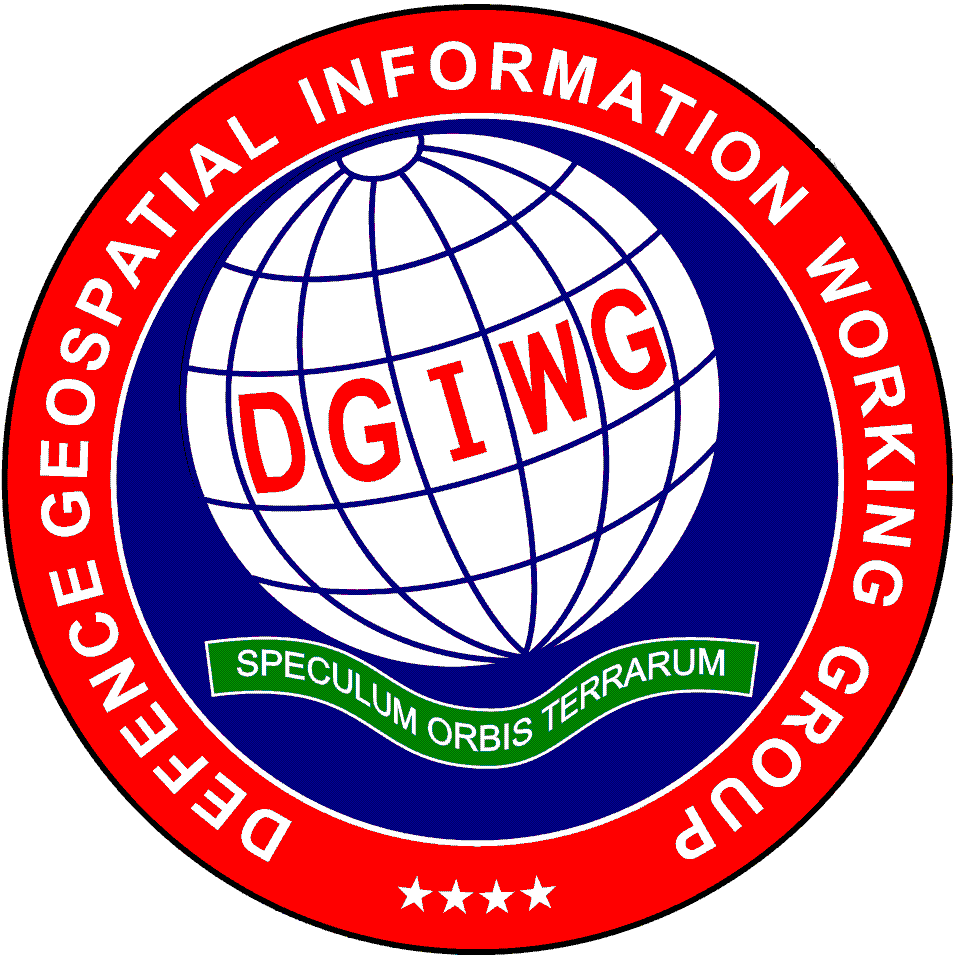
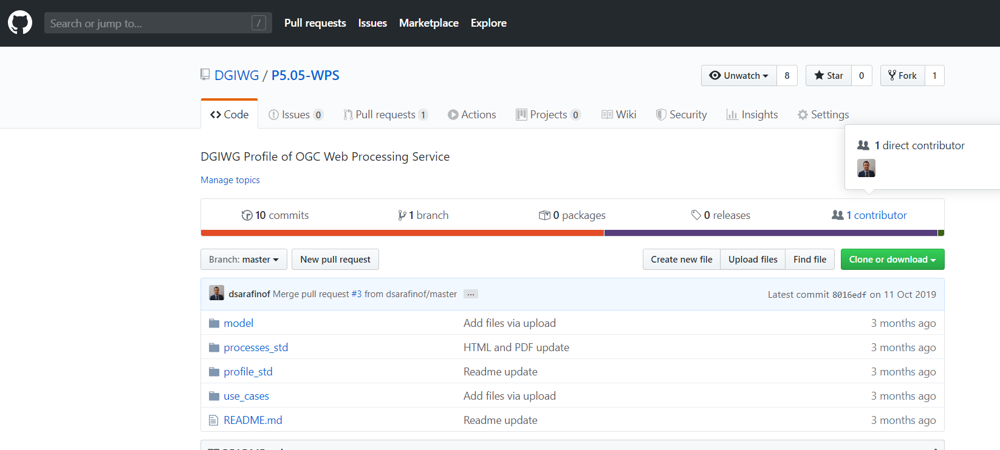
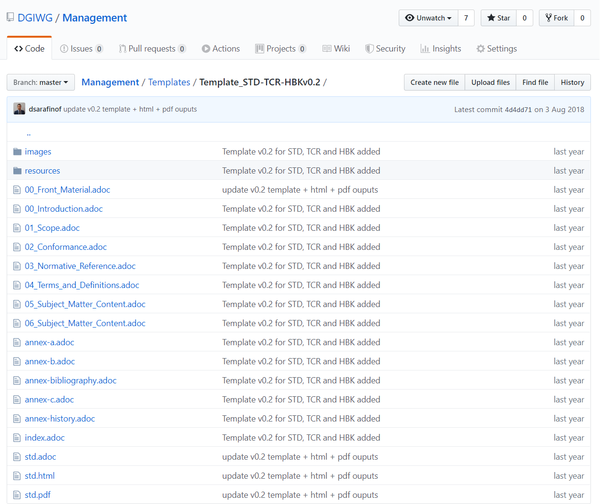
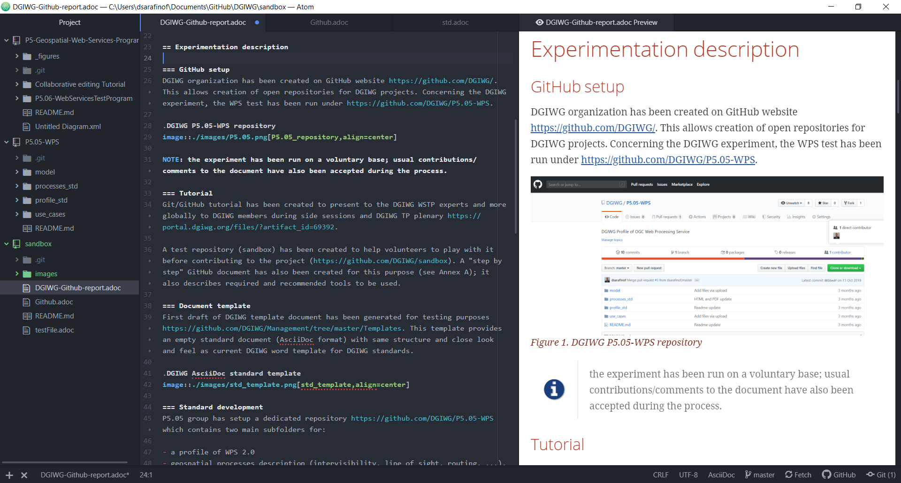
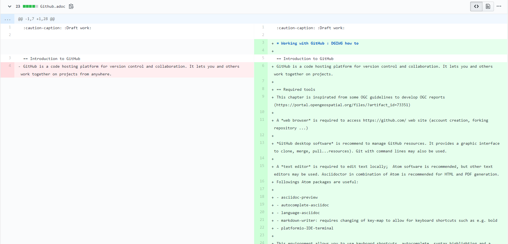
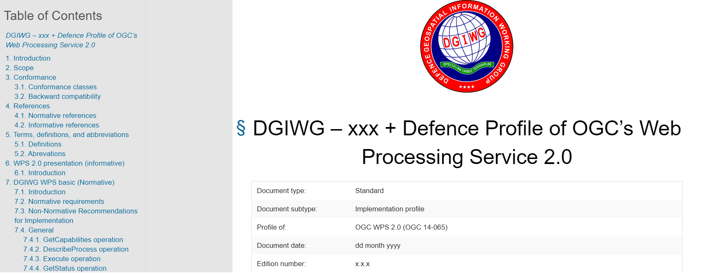
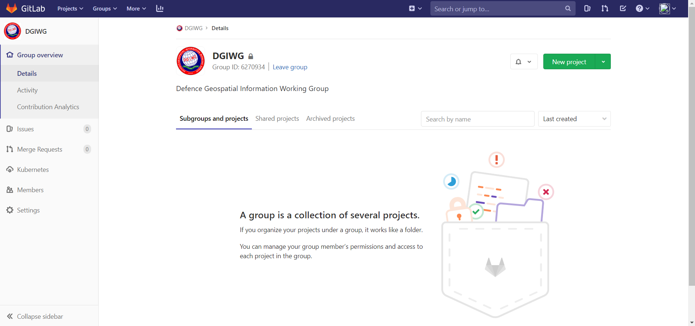
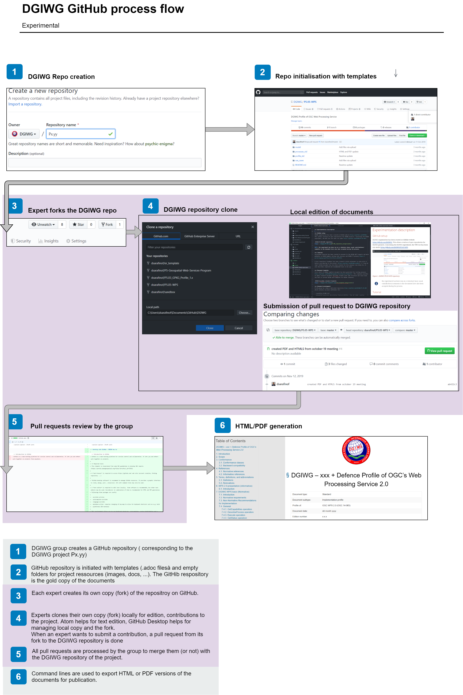

:caution-caption: :Draft work:

:title: DGIWG GitHub report

:submissionDate: 03-02-2020

:editor: Dimitri Sarafinof

:workingGroup: DGIWG WSTP

:category: DGIWG Technical Report
:publicationDate: DD-MM-YYYY
:approvalDate: DD-MM-YYYY
:referenceURLID: ID
:copyrightYear: 2020
//
:titletext: {title}
:doctype: book
:encoding: utf-8
:lang: en
:toc: left
:toclevels: 3
:numbered:
:sectanchors:
:source-highlighter: coderay
// set media to output format print or screen for pdf export
:media: print
:icons: font
:bibtex-file: resources/bibtex-file.bib
:bibtex-style: resources/lncs.csl

[.text-center]
= {title}
[#front_page,reftext='{table-caption}']
[cols="25,85"]
!===
|Document type:	|Technical Report
// subtype and profile of may be used for Standard

|Document date:	|3rd February 2020
// The x.x.x. designation is not used for draft documents. See DGIWG – 920 for additional details.
|Edition number:	|0.2.0
|Responsible Party: 	|DGIWG
|Editor : | {editor}
// The ‘Editor’ field is optional. The field is not used for documents that are cleared for public release._
|Audience: 	|DGIWG participants and associates
|Abstract: 	|This document describes the GitHub experimentation ran by DGIWG WSTP about using GitHub tools within the DGIWG specific standardization process.
|Copyright:	|(C) Copyright DGIWG, some rights reserved  -  (CC) (By:) Attribution
You are free:
-	to copy, distribute, display, and perform/execute the work
-	to make derivative works
-	to make commercial use of the work
Under the following conditions:
-	(By:) Attribution. You must give the original author (DGIWG) credit.
-	For any reuse or distribution, you must make clear to others the license terms of this work.
Any of these conditions can be waived if you get permission from the copyright holder DGIWG.
Your fair use and other rights are in no way affected by the above.
This is a human-readable summary of the Legal Code (the full license is available from Creative Commons <http://creativecommons.org/licenses/by/2.0/ >).
!===

== Introduction

=== Context
OGC is using GitHub tools for developing standards and testbeds reports. This process has several advantages:

- a unique gold copy of the document (and other resources like schemas)
- version control of the resources
- focus on the content and not on the look of the document (also avoid errors in references, text styles, numbering, ...)
- easy contribution and merge of the comments/contributions with full traceability

From asciidoc text format(.adoc), PDFs or HTMLs can be generated quite easily for document publication (with recommended tools).

_PS : the NGA also develops its own profiles on Github (https://github.com/ngageoint/)._

=== Aim
DGIWG management team agreed on a one year experiment period for the P5-05 project (Web Processing Services). A DGIWG experimentation has then been run in 2019 to investigate use of GitHub tools for helping the process development of DGIWG standards.

== Experimentation description

=== GitHub setup
DGIWG organization has been created on GitHub website https://github.com/DGIWG/. This allows creation of open repositories for DGIWG projects. For the DGIWG experiment, the DGIWG WPS profile  development has been run under https://github.com/DGIWG/P5.05-WPS.

.DGIWG P5.05-WPS repository

NOTE: the GitHub experiment has been run on a voluntary base; usual contributions/comments to the document have also been accepted during the process.

=== Tutorial
A Git/GitHub tutorial has been created to be presented to the DGIWG WSTP experts and more globally to DGIWG members during side sessions and DGIWG TP plenary https://portal.dgiwg.org/files/?artifact_id=69392.

A test repository (sandbox) has been created to help volunteers to play with it before contributing to the project (https://github.com/DGIWG/sandbox). A "step by step" GitHub document has also been created for this purpose (see Annex A); it also describes required and recommended tools to be used (such as Atom text editor, useful plugins, Asciidoctor ...)

=== Document template
A first draft of the DGIWG template document has been generated for GitHub testing purposes https://github.com/DGIWG/Management/tree/master/Templates. This template provides an empty DGIWG standard document (AsciiDoc format) with same structure and look and feel as the current DGIWG word template for DGIWG standards.

.DGIWG AsciiDoc standard template

=== Standard development
The P5.05 group has setup a dedicated repository https://github.com/DGIWG/P5.05-WPS which contains two main subfolders for:

- a profile of WPS 2.0
- geospatial processes description (intervisibility, line of sight, routing, ...).

Contributions (with text editor Atom) have been made on each expert clone of the repository before submitting pull request to the DGIWG repository. See workflow and tutorial in the <<_annex_a>>.

[NOTE]
Atom is a text editor that let experts edit the text locally on their computer (see figure below)

.Edition of documents with Atom text editor and document preview

Local editions are submitted by experts on the DGIWG GitHub (pull request mechanism); differences are highlighted and easy to discuss (see figure below).

.GitHub comparison during the pull request process

Each of these two documents follows the previous defined template. Command lines allow easy generation of PDF or HTML documents (draft documents have been generated to allow easier reading and commenting). This also can be done with a plugin of the Atom editor.

.HTML generation from an AsciiDoc document with a command line
----
asciidoctor -r asciidoctor-bibtex -a linkcss -a stylesheet=dgiwg.css -a stylesdir=resources/stylesheets std.adoc
----

.DGIWG HTML rendering from the current draft template

=== And what about GitLab ?
GitLab is another Git-based repository, offering more or less the same functionalities as GitHub. One of the main differences is that GitLab private repositories are free (public repositories are charged), whereas GitHub offers the opposite (public is free, private is charged).
OGC has then investigated the use of GitLab and now (announced the 14th of January 2020) offers its own flavor on https://gitlab.ogc.org/. OGC procedure is simple, "*Private Repos = GitLab  /  Public Repos = GitHub*". the process development is the same.
DGIWG P5 has also created the DGIWG organization under GitLab, but has not investigated its usability yet.

.DGIWG Group created under GitLab

== Feedback
=== Advantages

1. publicly available and free tools allow easy offline editing and contributions between meetings
2. merging contributions is an easy step and is managed by github.com web site (pull requests). Differences (additions, deletions...) are highlighted, discussions during meetings or teleconferences becomes easier.
3. managing references, tables and images is much easier (at least it is automatic based on a simple syntax and no error is introduced by exchanging a word document between people which use different Office versions or different language settings).
NOTE: the final editing part of a DGIWG standard for publication as Word or PDF document is a demanding task (that even with most carefulness may lead to  mistakes or erroneous references in   published DGIWG documents).

4. using the same technology and workflow as OGC may also be an advantage for DGIWG when profiling OGC standards. This is especially of interest for Web services and upcoming OGC APIs profiles, but can also be an advantage for nations aiming at developing national profiles based upon DGIWG standards.
5. becoming friendly with the tools and the DGIWG proposed workflow requires only a few hours.

=== Some identified issues
The proposal to use GitHub and contribute to a collaborative approach to developing DGIWG profiles and Standards, it is assumed that:

1. the user has access to the Open Internet both to GitHub and GitHub download App plugin sites from a Military Network.
2. the Network the user is working on does not have any JavaScript (transactional) restrictions.
3. the User has Administrate Rights to install on their respective computer.
4. the User does not have any restrictions of items such as the ‘Command Line Interface’.
5. the Military network can interact with the GitHub/Lab and Local Machine Repo.

[NOTE]
These issues have been identified by GBR. Full analysis can be found in the document https://portal.dgiwg.org/files/?artifact_id=70084["Using GitHub on Defence Military Networks"].

=== Possible way forward
Moving directly to a full GitHub process for developing DGIWG standards does not seems to be the better path now.
Generating Word versions of the a.doc documents for people having no access to GitHub has been experienced for writing this report (and for P5.05). Word file may be generated easily from the HTML version. This allows then commenting and contributing from all experts (comments done via Word have to be re-inserted into the adoc file on GitHub by someone having access to it).

=== Things to be checked
1. Tools installation (see <<_annex_b>>)
2. Access to https://github.com/ (only for specific tasks)

=== Recommendations and way forward

1. *Continue P5.05 experiment* and finalize it with GitHub tools
2. *Start investigation of GitLab* in line with OGC process
3. *Finalize DGIGW documents template in asciidoc* (+ CSS)
4. *Review all resources* to support using GitHub/GitLab for DGIWG
5. *Extend experiment to other DGIWG panel(s)* (volunteers ?) to gather wider feedback
6. *Setup management rights* on https://github.com/DGIWG/

== Annex A
.DGIWG simple flow for standard development under GitHub

== Annex B

include::Github.adoc[]
